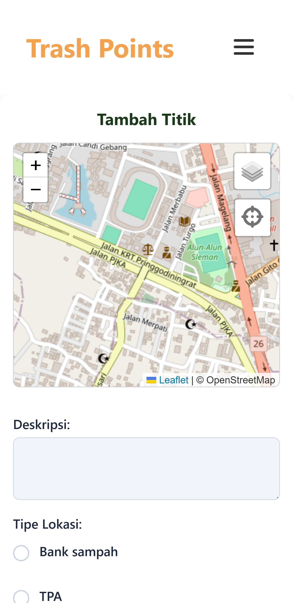
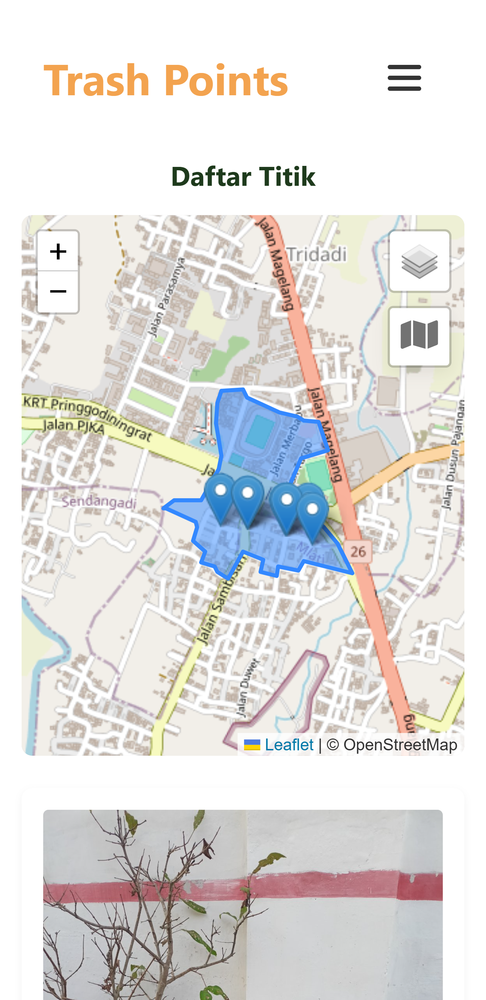

# Trash-Point

**Trash-Point** merupakan aplikasi pelaporan titik sampah yang memungkinkan pengguna untuk menandai dan mendokumentasikan lokasi tempat sampah seperti bank sampah, TPA, tempat sampah umum, dan sumur kompos melalui antarmuka web interaktif.

🧑‍🤝‍🧑 Proyek ini merupakan bagian dari kegiatan **Kuliah Kerja Nyata (KKN) YO021** daerah Padukuhan Jaban, Kalurahan Tridadi, Kapenewon Sleman, Daerah Istimewa Yogyakarta dengan kontributor utama oleh **Miftah Desma Syahputra**. Aplikasi web ini mendukung mobile dan desktop, sehingga bisa digunakan di perangkat apapun.

### 📱 Mobile View

### 💻 Desktop View

---

## 🎯 Tujuan Proyek

Membangun platform pelaporan titik sampah berbasis web untuk mendorong kesadaran lingkungan, membantu pemetaan titik-titik sampah, dan memudahkan pengelolaan sampah oleh masyarakat.

---

## 🚀 Fitur Utama

- **📍 Pelaporan Titik Sampah:** Tambahkan titik sampah baru dengan deskripsi, foto, jenis, status (aktif/tidak aktif), dan koordinat lokasi.
- **🗂️ Tampilan Daftar:** Semua titik sampah ditampilkan dalam bentuk kartu informasi.
- **🗺️ Tampilan Peta:** Visualisasi interaktif titik sampah di peta menggunakan Leaflet.js.
- **🔍 Detail Laporan:** Lihat informasi lengkap dari setiap laporan.
- **🔐 Autentikasi Pengguna:** Hanya pengguna terdaftar yang dapat menambahkan atau menghapus laporan.
- **🗑️ Hapus Laporan:** Pengguna dapat menghapus laporan yang telah mereka buat.

---

## 🛠️ Teknologi yang Digunakan

### Frontend

- **Leaflet.js:** Peta interaktif.
- **GSAP:** Animasi antarmuka.
- **Tailwind CSS:** Styling responsif dan efisien.
- **Webpack:** Pengelola bundel aset proyek.

### Backend & Database

- **Firebase:**
  - **Firestore:** Database real-time untuk laporan dan pengguna.
  - **Authentication:** Sistem login dan register pengguna.
- **Cloudinary:** Penyimpanan foto yang diunggah pengguna.
- **Netlify Functions:** API serverless untuk proses upload dan delete foto ke Cloudinary.

---

## 🧱 Struktur Proyek

Proyek ini menggunakan pola arsitektur **Model-View-Presenter (MVP)**, dengan pembagian file dalam folder:
- `models/` – logika dan data.
- `views/` – tampilan UI.
- `presenters/` – penghubung antara model dan view.

---

## ♿ Aksesibilitas

Aplikasi ini juga dirancang dengan memperhatikan kebutuhan pengguna dengan disabilitas, terutama:

- 🔊 **Dukungan VoiceOver dan Screen Reader** di desktop.
- 🏷️ Menggunakan elemen HTML semantik dan atribut `aria-*` untuk membantu pembacaan konten secara lebih jelas oleh pembaca layar.
- ⌨️ Navigasi yang dapat diakses penuh menggunakan keyboard (tanpa mouse).
- 🔄 Feedback dinamis menggunakan `aria-live` untuk update konten secara real-time.

Tujuan dari fitur aksesibilitas ini adalah agar Trash-Point bisa digunakan oleh siapa pun, termasuk pengguna tunanetra dan pengguna dengan mobilitas terbatas.

---

## 🌐 Tentang Proyek

Trash-Point dikembangkan sebagai Progressive Web App (PWA) untuk mempermudah pelaporan titik sampah di berbagai lokasi. Proyek ini diharapkan dapat membantu masyarakat Padukuhan Jaban dalam mewujudkan pengelolaan sampah yang lebih baik dan terorganisir.

---

